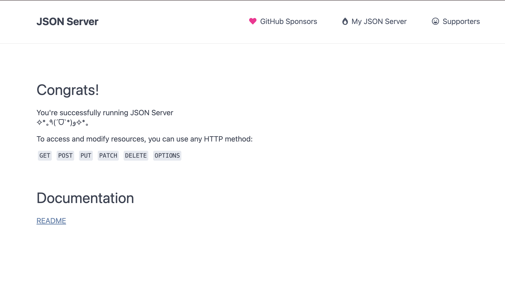

## 임예원

## json-server 배포 과정

### 1. server repository 생성

- github에 새로운 repository를 생성한다!
- server.js 파일을 생성한다.

```js
const jsonServer = require('json-server');
const server = jsonServer.create();
const router = jsonServer.router('db.json');
const middlewares = jsonServer.defaults();

// server.use((req, res, next) => {
//   res.header("Access-Control-Allow-Origin", "*");
//   res.header("Access-Control-Allow-Methods", "GET, POST, PUT, PATCH, DELETE");
//   res.header("Access-Control-Allow-Headers", "Content-Type");
//   next();
// });

server.use(middlewares);
server.use(jsonServer.bodyParser);
server.use('/api', router);

const port = process.env.PORT || 3000;
server.listen(port, () => {
  console.log(`JSON Server is running on port ${port}`);
});
```

- package.json 파일도 생성한다!

```json
{
  "name": "server",
  "version": "1.0.0",
  "description": "json-server on Glitch",
  "main": "server.js",
  "scripts": {
    "start": "node server.js"
  },
  "keywords": [],
  "author": "",
  "license": "ISC",
  "dependencies": {
    "json-server": "^0.17.4"
  }
}
```

- 마지막으로 db.json 파일에 db를 넣는다

```json
{
  "Auth": [],
  "Balance": [],
  "Category": [],
  "Ment": [],
  "Setting": []
}
```

### 2. 배포된 것 확인하기!

- Glitch에서 github repo를 불러와서 배포를 시작한다..
- 여기서 잘 안될 경우... 회원탈퇴 후에 다시 해봐라ㅠㅠ
- 그렇게... N회차 시도만에...
  

- 위와 같은 화면 보기 성공 !

### 3. 트러블 슈팅

- .env 파일 생성: 여기서 첫 번째 큰 난관이 발생한다..
  - 하하.. 내가 server.js 파일에 적은 아래와 같은 코드는 배포 url에다가 /api를 꼭 붙여야만 한다는 코드다

```js
server.use('/api', router);
```

- 하놔... 그래서 계속 /data이름으로만 axios를 하니, 절대 안되는 것이다
